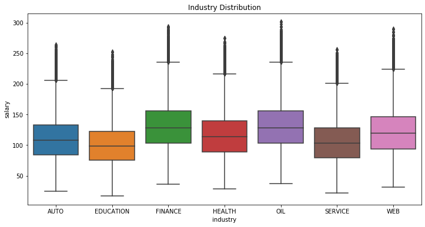
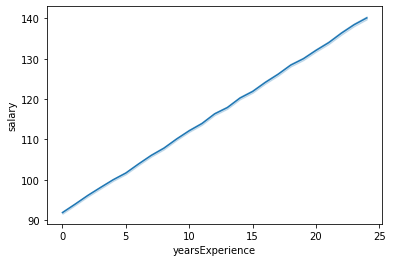

# Salary Prediction Portfolio

## DEFINE THE PROBLEM
For this Salary prediction portfolio I chose to examine 1 million job records along with their features such as **Job Type, Major, Degree, Industry, Years of Experience, Distance from the metropolis area** and the given **SALARY**. Based on this data, I'm going to build some predictive models and choose the best model (having lowest MSE) and use it to predict salaries of another 1 million jobs based on their features.

### PROJECT OUTLINE:

- Load the data, Understand the data, Find relationships between attributes
- Establish a baseline model, Engineer features, Optimize the data features
- Select the best model with the lowest Evaluation metric and
- **Predict salaries of another 1 million job features using the selected model**

## DISCOVER DATA
The Salary distribution histogram plot!

The salary histogram is right skewed, and most values lie between 70k to 150k

### DISTRIBUTION OF CATEGORICAL VARIABLES IN THE DATASET

 &ensp;&ensp;&ensp;  
 &ensp;&ensp;&ensp; 

- The job_type CEO has the highest salary distribution and the Janitor has the lowest.
- The degrees 'Doctoral' and 'Masters' has a higher salary distribution and people with no major (i.e "NONE") has the lowest
- All the majors have more or less the same salary distribution. Although Engineering major seems to have a little edge over Business major. None major has the lowest distribution
- Industries 'Oil' and 'Finance' seems to have the highest salary distribution than others.

### DISTRIBUTION OF NUMERICAL VARIABLES IN THE DATASET

  

- The yearsExperience variable has a positive and steady relationship with salary which means, as the years of experince increase the salary will also increase substantially
- The milesFromMetropolis variable has a negative and steady relationship with salary which means, as the job location is further away from the metropolis the salary will go on decreasing
