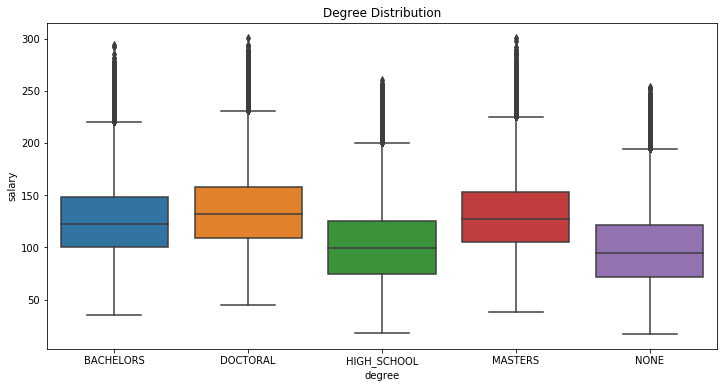

# Salary Prediction Portfolio

## DEFINE THE PROBLEM
For this Salary prediction portfolio I chose to examine 1 million job records along with their features such as **Job Type, Major, Degree, Industry, Years of Experience, Distance from the metropolis area** and the given **SALARY**. Based on this data, I'm going to build some predictive models and choose the best model (having lowest MSE) and use it to predict salaries of another 1 million jobs based on their features.

### PROJECT OUTLINE:

- Load the data, Understand the data, Find relationships between attributes
- Establish a baseline model, Engineer features, Optimize the data features
- Select the best model with the lowest Evaluation metric and
- **Predict salaries of another 1 million job features using the selected model**

## DISCOVER DATA
The Salary distribution histogram plot!

The salary histogram is right skewed, and most values lie between 70k to 150k

### DISTRIBUTION OF CATEGORICAL VARIABLES IN THE DATASET

 &ensp;&ensp;&ensp;  
 &ensp;&ensp;&ensp; 

- The job_type CEO has the highest salary distribution and the Janitor has the lowest.
- The degrees 'Doctoral' and 'Masters' has a higher salary distribution and people with no major (i.e "NONE") has the lowest
- All the majors have more or less the same salary distribution. Although Engineering major seems to have a little edge over Business major. None major has the lowest distribution
- Industries 'Oil' and 'Finance' seems to have the highest salary distribution than others.

### DISTRIBUTION OF NUMERICAL VARIABLES IN THE DATASET

  

- The yearsExperience variable has a positive and steady relationship with salary which means, as the years of experince increase the salary will also increase substantially
- The milesFromMetropolis variable has a negative and steady relationship with salary which means, as the job location is further away from the metropolis the salary will go on decreasing

### CORRELATION MATRIX

- Positive correlation between variables **job_Type, degree, major, industry, yearsExperience** and **Salary**
- Negative correlation between variable **milesFromMetropolis** and **Salary**
- Strong positive correlation between **degree** and **major** which is likely to be
- Weak yet positive correlation between **job_Type** and **degree, major** 
- **job_id & company_id** have a wekest possible or a negligible correlation with **salary**

## DEVELOP MODEL
- The variable **job_Id** is unique to each and every data record and **company_Id** has a negligible correlation with **Salary**. Hence, it will be best to exclude these      variables for modelling. 
- Variables **job_Type, degree, major, industry** are categorical variables. Thus, one-hot encoding them will be better for modeling.

### Based on the above EDA, I chose the following predictors for modelling

| VARIABLE      | TYPE          |Columns|
| ------------- | ------------- |-------|
| yearsExperience  | INT  |1|
| milesFromMetropolis  | INT  |1|
|job_Type - CFO, CTO, Janitor, Junior, Manager, Senior, Vice-president |CAT - INT| 7|
|degree - High_school, Bachelors, Masters, Doctral |CAT - INT|4|
|major - Biology, Business, Chemistry, CompSci, Literature, Math, Physics |CAT - INT|7|
|industry - Education, Finance, Health, Oil, Service, Web |CAT - INT|6|
|**Total number of predictors**||**27**|

Final dataset consists of 9999995 rows and 27 columns.
I created a baseline model which predicted salaries for every record based on the **mean** of that paticular **job_type**.
After prediction, I used Mean_squared_error as an evaluation metric and got the following result
|Model|MSE_Score|
|-----|-----|
|Baseline_model|963.92|

I split this dataset as training and testing dataset witha asplit of 0.70 for training and 0.30 for testing. I used these models used after feature engineering and their Mean_squared_error were obtained as follows:
|No.|Model|MSE_Score|Standard-deviation|
|---|-----|---------|------------------|
|1. |Linear Regression|385.23|1.89|
|2. |Random Forest Regressor|377.06|1.49|
|3. |Gradient Boosting Regressor|359.87|1.37|

#### Gradient Boosting Regressor provides the best results so I used this model to predict the salaries of a completely different job records and saved it in a csv file.

The Plot below shows the feature importances of the features used in the model
 

# THANK YOU!

